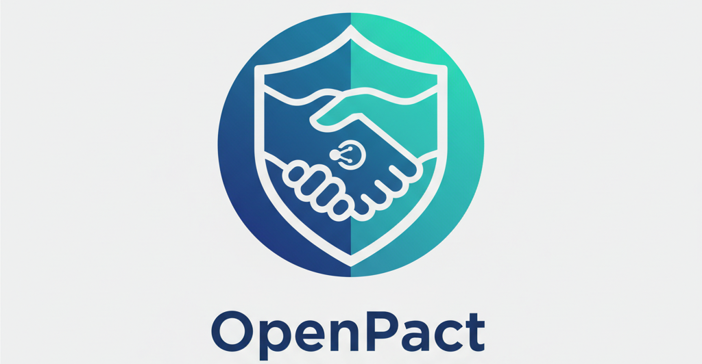

# OpenPact



A secure, minimal framework for running your own AI assistant. Built in Go, engine-agnostic, with sandboxed capabilities.

**Website:** [openpact.ai](https://openpact.ai)

## Features

- **Security-first**: Principle of least privilege - AI can only use explicitly defined MCP tools
- **Engine-agnostic**: Works with OpenCode (75+ providers)
- **Sandboxed scripting**: Starlark-based custom skills with secure secret handling
- **Docker-native**: Two-user security model, easy deployment
- **Production-ready**: Structured logging, Prometheus metrics, health checks, rate limiting

## Quick Start

```bash
docker run -d \
  -v openpact-workspace:/workspace \
  -e DISCORD_TOKEN=your_token \
  ghcr.io/open-pact/openpact:latest
```

## MCP Tools

OpenPact exposes capabilities through MCP (Model Context Protocol) tools:

| Tool | Description |
|------|-------------|
| `workspace_read` | Read files from the workspace |
| `workspace_write` | Write files to the workspace |
| `workspace_list` | List files in the workspace |
| `memory_read` | Read from memory files |
| `memory_write` | Write to memory files |
| `discord_send` | Send Discord messages proactively |
| `calendar_read` | Read events from iCal feeds |
| `vault_read` | Read from Obsidian vault |
| `vault_write` | Write to Obsidian vault with git sync |
| `vault_list` | List files in vault |
| `vault_search` | Search vault content |
| `web_fetch` | Fetch and parse web pages |
| `github_list_issues` | List GitHub issues |
| `github_create_issue` | Create GitHub issues |
| `script_list` | List available Starlark scripts |
| `script_run` | Execute a Starlark script by name |
| `script_exec` | Execute arbitrary Starlark code |
| `script_reload` | Reload scripts from disk |

---

## Starlark Scripting

OpenPact includes a powerful, sandboxed scripting system using [Starlark](https://github.com/bazelbuild/starlark) (a Python-like language). Scripts can make HTTP requests, parse JSON, and access secrets securely.

### Example: Weather Script

Create a file at `<workspace>/scripts/weather.star`:

```python
# @description: Get current weather for a city
# @secrets: WEATHER_API_KEY

def get_weather(city):
    """Fetch weather from WeatherAPI.com"""
    api_key = secrets.get("WEATHER_API_KEY")
    url = format("https://api.weatherapi.com/v1/current.json?key=%s&q=%s", api_key, city)

    resp = http.get(url)
    if resp["status"] != 200:
        return {"error": "API request failed", "status": resp["status"]}

    data = json.decode(resp["body"])
    return {
        "city": data["location"]["name"],
        "country": data["location"]["country"],
        "temp_c": data["current"]["temp_c"],
        "temp_f": data["current"]["temp_f"],
        "condition": data["current"]["condition"]["text"],
        "humidity": data["current"]["humidity"],
        "wind_kph": data["current"]["wind_kph"]
    }

# Default execution
result = get_weather("London")
```

The AI can then run this script:
```
Tool: script_run
Args: {"name": "weather"}
```

Or call a specific function with arguments:
```
Tool: script_run
Args: {"name": "weather", "function": "get_weather", "args": ["Tokyo"]}
```

### Built-in Functions

| Module | Function | Description |
|--------|----------|-------------|
| `http` | `http.get(url, headers={})` | HTTP GET request, returns `{status, body, headers}` |
| `http` | `http.post(url, body="", headers={}, content_type="application/json")` | HTTP POST request |
| `json` | `json.encode(value)` | Convert value to JSON string |
| `json` | `json.decode(string)` | Parse JSON string to value |
| `time` | `time.now()` | Current UTC time (RFC3339 format) |
| `time` | `time.sleep(seconds)` | Sleep (max 5 seconds) |
| `secrets` | `secrets.get(name)` | Get a secret value (AI never sees this) |
| `secrets` | `secrets.list()` | List available secret names |
| - | `format(fmt, args...)` | Printf-style string formatting |

### Script Metadata

Scripts can declare metadata in comments:

```python
# @description: What this script does
# @author: Your Name
# @version: 1.0.0
# @secrets: API_KEY, OTHER_SECRET
```

The `script_list` tool returns this metadata so the AI knows what scripts are available and what secrets they need.

### Security Model

```
┌─────────────────────────────────────────────────────────────────┐
│                         AI Model                                 │
│  (Cannot see secret values - only sees [REDACTED:NAME])         │
└─────────────────────────────────────────────────────────────────┘
                              │
                              ▼
┌─────────────────────────────────────────────────────────────────┐
│                     MCP Script Tools                             │
│  script_run, script_exec, script_list, script_reload            │
└─────────────────────────────────────────────────────────────────┘
                              │
                              ▼
┌─────────────────────────────────────────────────────────────────┐
│                    Starlark Sandbox                              │
│  ┌─────────────┐  ┌─────────────┐  ┌─────────────────────────┐  │
│  │ HTTP Client │  │    JSON     │  │   Secret Provider       │  │
│  │ (http/https │  │ encode/     │  │   secrets.get("KEY")    │  │
│  │  only)      │  │ decode      │  │   → returns real value  │  │
│  └─────────────┘  └─────────────┘  └─────────────────────────┘  │
└─────────────────────────────────────────────────────────────────┘
                              │
                              ▼
┌─────────────────────────────────────────────────────────────────┐
│                   Result Sanitizer                               │
│  Scans all output for secret values and replaces them with      │
│  [REDACTED:SECRET_NAME] before returning to AI                  │
└─────────────────────────────────────────────────────────────────┘
                              │
                              ▼
┌─────────────────────────────────────────────────────────────────┐
│                      AI Model                                    │
│  Receives: {"temp_c": 15.5, "url": "...key=[REDACTED:API_KEY]"} │
└─────────────────────────────────────────────────────────────────┘
```

**Key security features:**

1. **No filesystem access** - Scripts cannot read/write files
2. **HTTP only** - Only `http://` and `https://` URLs allowed (no `file://`)
3. **Response size limit** - 10MB max response body
4. **Execution timeout** - Configurable (default 30s)
5. **Secret isolation** - AI never sees raw secret values
6. **Result sanitization** - All output scanned for accidental secret leakage

---

## Configuration

Create `openpact.yaml`:

```yaml
workspace:
  path: /workspace

discord:
  enabled: true
  allowed_users:
    - "123456789"  # Your Discord user ID

vault:
  path: /vault
  git_repo: git@github.com:user/vault.git
  auto_sync: true

calendars:
  - name: Personal
    url: https://calendar.google.com/...ical

github:
  enabled: true
  # Set GITHUB_TOKEN environment variable

starlark:
  enabled: true
  max_execution_ms: 30000  # 30 seconds
  secrets:
    WEATHER_API_KEY: "${WEATHER_API_KEY}"  # From environment
    GITHUB_TOKEN: "${GITHUB_TOKEN}"

engine:
  type: opencode
  provider: anthropic
  model: claude-sonnet-4-20250514

logging:
  level: info  # debug, info, warn, error
  json: false  # true for JSON output

server:
  health_addr: ":8080"
  rate_limit:
    rate: 10   # requests per second
    burst: 20  # max burst size
```

## Endpoints

When running, OpenPact exposes:

- `GET /health` - Detailed health status with component checks
- `GET /healthz` - Kubernetes-style health probe
- `GET /ready` - Readiness check
- `GET /metrics` - Prometheus-format metrics

## Context Injection

Place these files in your workspace to customize the AI's behavior:

- `SOUL.md` - Core identity and personality
- `USER.md` - User preferences and context
- `MEMORY.md` - Persistent memory and notes

## Project Structure

```
openpact/
├── cmd/
│   └── openpact/       # Main orchestrator CLI
├── internal/
│   ├── config/         # YAML config loading
│   ├── context/        # Context injection (SOUL/USER/MEMORY)
│   ├── discord/        # Discord bot integration
│   ├── engine/         # AI engine abstraction
│   ├── health/         # Health checks & metrics
│   ├── logging/        # Structured logging
│   ├── mcp/            # MCP server & tools
│   ├── orchestrator/   # Component coordination
│   ├── ratelimit/      # Token bucket rate limiting
│   └── starlark/       # Sandboxed scripting
├── templates/          # Default templates
└── Dockerfile
```

## Local Development

### With Docker Compose (recommended)

```bash
# 1. Copy the sample env file and fill in your values
cp .env.sample .env

# 2. Create your workspace directory
mkdir -p ~/.config/openpact/workspace

# 3. Set HOST_WORKSPACE_PATH in .env to point to it
#    HOST_WORKSPACE_PATH=~/.config/openpact/workspace

# 4. Build and start
docker compose up --build

# 5. Rebuild after code changes
docker compose up --build -d
```

The workspace directory is mounted into the container at `/workspace`. Each developer sets their own `HOST_WORKSPACE_PATH` in `.env` — this must be outside the project directory.

The admin UI will be available at `http://localhost:8888` and health/metrics at `http://localhost:8081`.

### Without Docker

```bash
# Build the admin UI first (required for Go tests and embedding)
cd admin-ui && npm install && npm run build && cd ..

# Build the Go binary
make build

# Run tests (171 tests)
make test

# Run locally
export DISCORD_TOKEN=your_token
export ANTHROPIC_API_KEY=your_key
./openpact --config openpact.yaml
```

## License

MIT
